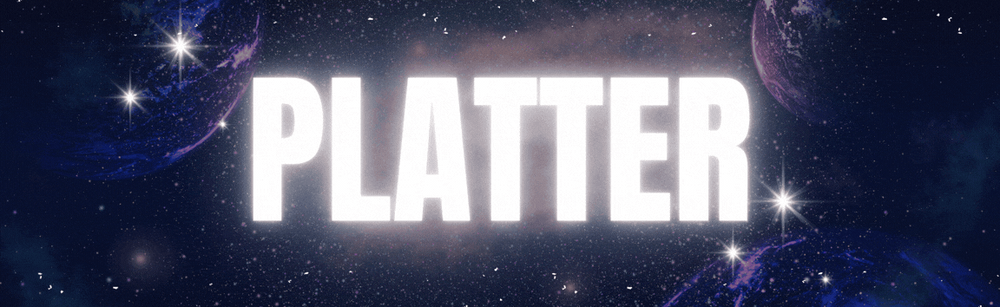
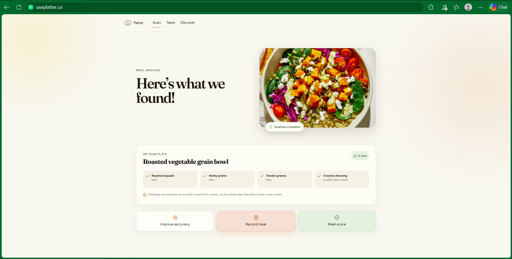
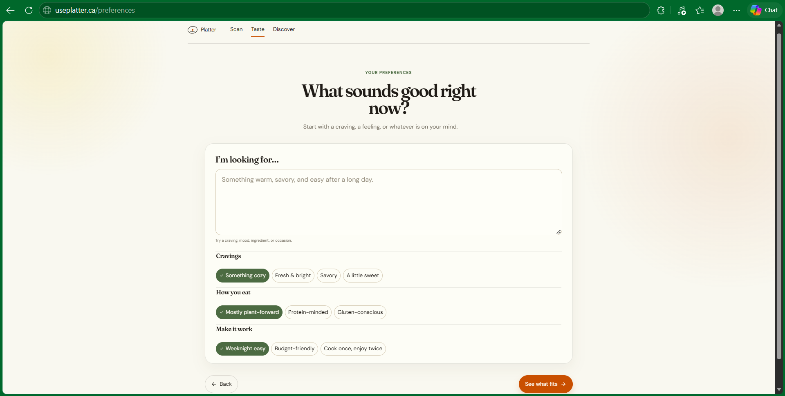
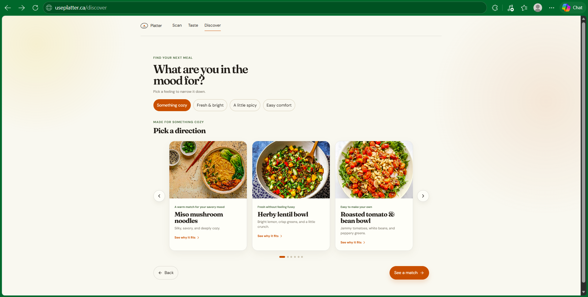
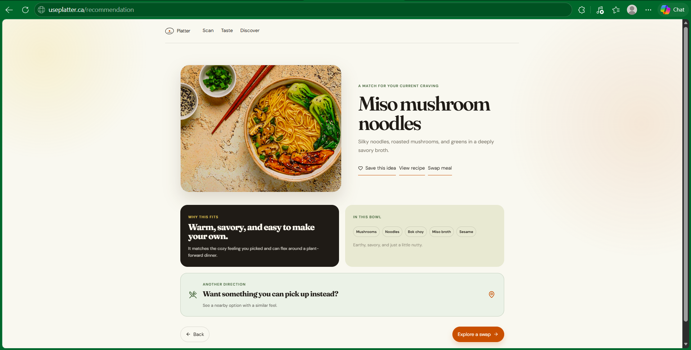
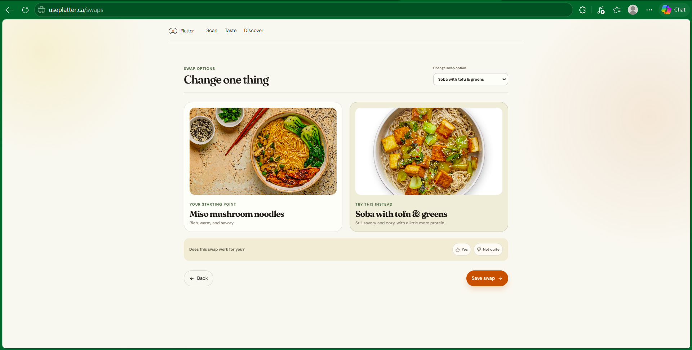
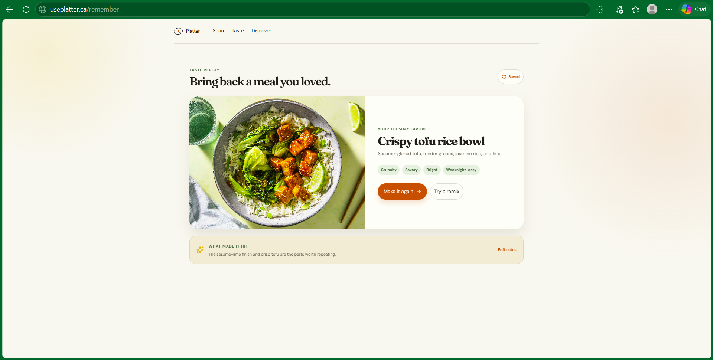

# 🍽️ Eat what you want. Know enough to not worry. ✨

---

### 📅 Official release dates

| Release | Date |
| --- | --- |
| Private preview | October 1, 2027 |
| Full release | April 2027 |

 

Platter helps you find meals that satisfy what you're craving while fitting
your preferences, dietary needs, and health goals. It is a thoughtful meal
companion for making choices that feel delicious, personal, and easier to
stick with—without a clinical tracker or a lecture.

## 🍽️ Snap a meal. See what you can do with it.

Take a photo of what is in front of you and let Platter turn it into a useful,
easy-to-understand starting point—so your next choice feels more like you.

  

## ✨ Tell Platter what matters to you

Set the preferences, dietary needs, and goals that shape the way you eat.
Whether you are looking for more protein, eating plant-forward, avoiding an
ingredient, or simply deciding what sounds good, Platter keeps your context in
the conversation.

  

## 😋 Follow the craving, not a rigid plan

In the mood for something savory, cozy, fresh, or sweet? Start there. Platter
helps you explore meals that meet the moment while staying aligned with the
things you care about.

  

## 🥗 Find the meal that fits

See satisfying suggestions built around your preferences and goals. Platter
helps you compare options, understand what is on the plate, and find the one
that makes sense for today—not an imaginary perfect day.

  

## 🔄 Make it yours

Change an ingredient, explore a swap, or choose another direction entirely.
Platter adapts with you, helping you make small, practical decisions without
turning food into a scorecard.

  

## 🌿 Eat with more confidence

Platter is built for real life: changing plans, favorite foods, spontaneous
cravings, and everyday goals. No shame, no rigid rules—just more clarity when
you want it.

  

---

## 💬 Join the table

Follow Platter's progress, share an idea, or help shape a more joyful way to
decide what to eat.

- [Follow development on GitHub](https://github.com/DavidAde6/Platter)
- [Share feedback or report an issue](https://github.com/DavidAde6/Platter/issues)

<!--
SOCIAL LINKS
When official accounts are ready, add prominent links here for Instagram,
TikTok, LinkedIn, and/or a newsletter. Use recognizable platform icons and
only link to verified Platter accounts.
-->
