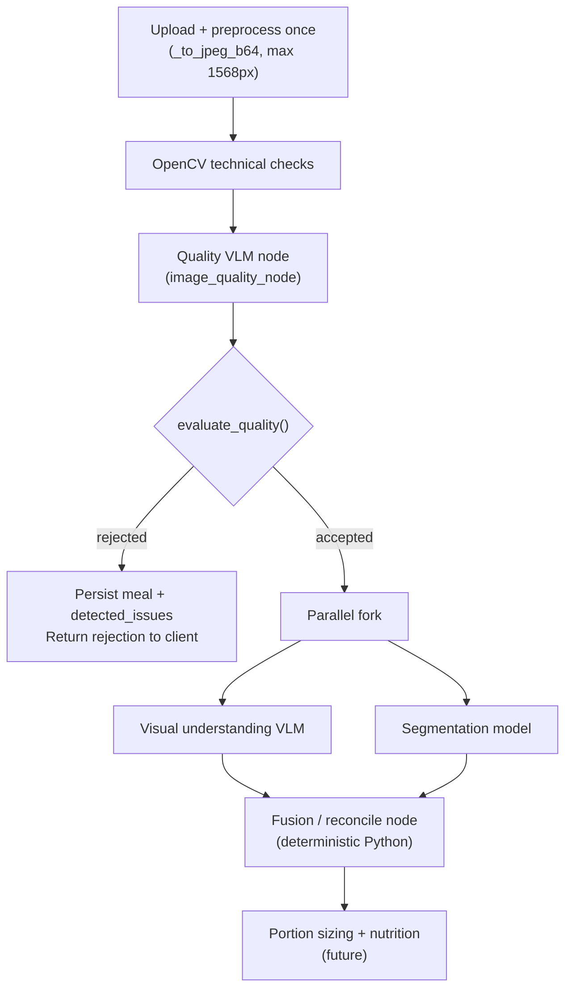

# Meal Analysis Pipeline — Design

This document describes how Platter's image-analysis stages fit together: the **quality gate** (implemented today), the planned **visual understanding** layer, and the planned **segmentation** layer. It covers prompt context, LangGraph wiring, model choices, and production patterns.

For what is implemented right now, see [`Guide.md`](Guide.md). For the phased build order and the sync/async decision, see [`PLANS.txt`](../PLANS.txt).

---

## Table of contents

1. [Overview](#overview)
2. [Three distinct jobs](#three-distinct-jobs)
3. [Pipeline order](#pipeline-order)
4. [Output schemas](#output-schemas)
5. [Passing quality context downstream](#passing-quality-context-downstream)
6. [LangGraph wiring](#langgraph-wiring)
7. [Fusion and reconciliation](#fusion-and-reconciliation)
8. [Model choices](#model-choices)
9. [Persistence](#persistence)
10. [Production patterns](#production-patterns)
11. [Implementation checklist](#implementation-checklist)

---

## Overview

Upload analysis today answers one question: **"Is this a usable food photo?"** The next stages answer:

- **What** is in the meal? (semantic understanding, ambiguity, cooking clues)
- **Where** is each item? (regions, masks, plate coverage for portion sizing)

Those downstream stages depend on the quality gate passing first. A blurry, non-food, or severely occluded photo should not trigger expensive food-identification and segmentation work.

The quality node already collects signals meant for downstream estimation (`portion_difficulty`, `depth_unclear`, `food_overlap_level`, `plate_visible`, etc.). They are stored in `image_qualities.detected_issues` but not yet consumed by later graph nodes. This document defines how they should be.

---

## Three distinct jobs

Each stage asks a different question and should use a focused model/prompt — not one mega-prompt that mixes usability judgment with food taxonomy.

| Stage | Question | Status | Primary output |
|-------|----------|--------|----------------|
| **Quality / issues** | Can we trust downstream calorie and macro estimation? | ✅ Implemented | `detected_issues.technical` + `detected_issues.vision` |
| **Visual understanding** | What foods are visible, with what ambiguity? | ❌ Planned | `visible_foods`, `cooking_clues`, `uncertainties` |
| **Segmentation** | Where is each item spatially? | ❌ Planned | `regions[]` with `bbox`, `mask`, `plate_coverage_percent` |

### Quality / issues (today)

**Deterministic layer** — `app/image_quality.py` → `analyze_image_quality()`

OpenCV checks: blur, brightness, over/underexposure, resolution. Stored under `detected_issues.technical`.

**Vision layer** — `app/graph/nodes.py` → `image_quality_node`

Claude (`claude-opus-4-8`) with structured JSON via `DETECTED_ISSUES_SCHEMA` in `app/graph/schema.py`. Stored under `detected_issues.vision`.

**Gating** — `app/quality_decision.py` → `evaluate_quality()`

Combines technical + vision into accept/reject. User-facing `rejection_reason` on rejected meals.

### Visual understanding (planned)

Holistic scene interpretation. Segmentation alone cannot infer:

- Likely hidden ingredients (oil, butter, sauce under rice)
- Cooking method from visual cues (browning, char, oil sheen)
- Ambiguity between visually similar foods (white rice vs. jollof vs. fried rice)
- Relationships between items (sauce on chicken, rice under curry)

This layer produces **semantic hypotheses**, not pixel-accurate geometry.

### Segmentation (planned)

Structured spatial output per food region:

- Bounding boxes and (preferably) masks
- Plate coverage percentage per region
- Occlusion level where applicable

This layer produces **geometry** for portion sizing and for aligning labels to image regions.

---

## Pipeline order



### Why this order

1. **Gate first** — Rejected photos skip food ID and segmentation. The quality call runs on every upload today; that is acceptable because it is cheaper than the full analysis stack and prevents bad inputs from polluting downstream estimates.

2. **Visual + segmentation in parallel** — After the gate, neither stage depends on the other's output. Both only need the preprocessed image (and optionally `quality_context`). Running them concurrently is the largest latency win.

3. **Fusion after both** — Align region labels to visible-food labels, merge confidence, and produce a single artifact for portion sizing and nutrition lookup.

### When to run sequentially instead

If segmentation accuracy is poor without label hints, a **guided segmentation** path is valid:

```
quality → visual understanding → segmentation (prompted with visible_foods labels)
```

Even then, keep a **fusion node** at the end. The two models will disagree sometimes; fusion is where conflicts are resolved deterministically rather than left implicit.

For Platter's first implementation, **parallel + fusion** is recommended. Add guided segmentation as an optimization if bbox quality is insufficient.

---

## Output schemas

### Visual understanding

Target shape for the visual understanding node:

```json
{
  "visible_foods": [
    {
      "label": "rice",
      "possible_types": ["white rice", "jollof rice", "fried rice"],
      "confidence": 0.78
    },
    {
      "label": "chicken",
      "possible_preparations": ["grilled", "roasted", "fried"],
      "confidence": 0.71
    }
  ],
  "visible_objects": ["plate", "fork"],
  "cooking_clues": ["browning on chicken", "slight oil shine"],
  "uncertainties": [
    "rice depth unclear",
    "oil amount not visible",
    "chicken cut unclear"
  ]
}
```

Design notes:

- **`label`** — coarse category the segmentation layer can match against.
- **`possible_types` / `possible_preparations`** — explicit ambiguity; downstream nutrition should use ranges, not a single USDA entry, when multiple options remain plausible.
- **`confidence`** — per-item, not global; propagate into portion and macro confidence separately.
- **`uncertainties`** — free-text flags; often overlap with quality signals (e.g. `"rice depth unclear"` mirrors `geometry.depth_unclear` from the quality node).

### Segmentation

Target shape for the segmentation stage:

```json
{
  "regions": [
    {
      "region_id": "r1",
      "label": "rice",
      "bbox": [120, 240, 410, 600],
      "mask_available": true,
      "plate_coverage_percent": 42,
      "occlusion_level": "low"
    },
    {
      "region_id": "r2",
      "label": "chicken",
      "bbox": [430, 250, 700, 580],
      "mask_available": true,
      "plate_coverage_percent": 24,
      "occlusion_level": "medium"
    }
  ]
}
```

Design notes:

- **`bbox`** — `[x1, y1, x2, y2]` in preprocessed image coordinates (same space as the 1568px JPEG sent to models).
- **`mask_available`** — `true` when a real segmentation model produced a mask; `false` when only bbox came from a VLM.
- **`plate_coverage_percent`** — fraction of visible plate area covered by this region; requires plate detection or a plate region from the same model.
- **`occlusion_level`** — optional; can mirror quality schema enums (`none`, `low`, `medium`, `high`).

### Fused output (after reconciliation)

The fusion node produces a merged artifact consumed by portion sizing and nutrition:

```json
{
  "items": [
    {
      "region_id": "r1",
      "label": "rice",
      "possible_types": ["white rice", "jollof rice", "fried rice"],
      "bbox": [120, 240, 410, 600],
      "plate_coverage_percent": 42,
      "semantic_confidence": 0.78,
      "spatial_confidence": 0.85,
      "combined_confidence": 0.66,
      "uncertainties": ["rice depth unclear", "oil amount not visible"]
    }
  ],
  "global_uncertainties": ["chicken cut unclear"],
  "portion_estimation_confidence": "medium"
}
```

---

## Passing quality context downstream

**Yes — pass quality signals into downstream prompts, but as a distilled `quality_context` bundle, not the raw `detected_issues` JSONB.**

Raw dumps add tokens without helping. Downstream models need **actionable constraints**, not the full technical Laplacian variance or every nested signal object.

### Building `quality_context`

Derive this in Python from `detected_issues` immediately after gating (no extra model call):

```json
{
  "plate_visible": true,
  "cropped_food": false,
  "depth_unclear": { "severity": "medium", "confidence": 0.82 },
  "food_overlap_level": "low",
  "sauce_hiding_food": false,
  "portion_difficulty": {
    "value": "medium",
    "confidence": 0.75,
    "reasons": ["rice depth unclear", "partial occlusion on chicken"]
  },
  "technical_flags": ["slight_blur"],
  "recommended_action": "continue_with_medium_confidence"
}
```

Mapping from today's schema (`app/graph/schema.py`):

| Source field | Include in `quality_context`? |
|--------------|-------------------------------|
| `food_detection.is_food_image` | No — already gated |
| `food_detection.food_confidence` | Optional — low value after accept |
| `visibility.plate_visible` | Yes |
| `visibility.cropped_food` | Yes |
| `geometry.bad_angle` | Yes |
| `geometry.depth_unclear` | Yes |
| `occlusion.food_overlap_level` | Yes |
| `occlusion.sauce_hiding_food` | Yes |
| `portion_estimation.portion_difficulty` | Yes — especially `reasons` |
| `recommended_action` | Yes — useful for routing and confidence discount |
| `technical.*.issue` | Yes — as short string flags (`blur`, `resolution`, etc.) |

Omit technical checks that did not trip (accepted meals may still have borderline blur that did not fail the threshold).

### What to pass where

| Signal | Visual understanding prompt | Segmentation prompt |
|--------|----------------------------|---------------------|
| `depth_unclear`, `portion_difficulty` | Widen `possible_types`; add matching `uncertainties` | Lower confidence on volume-sensitive regions |
| `food_overlap_level`, `sauce_hiding_food` | Infer hidden ingredients; note occlusion | Expect overlapping bboxes; avoid over-confident masks |
| `plate_visible` | Mention scale reference availability | Use plate boundary for `plate_coverage_percent` |
| `cropped_food`, `bad_angle` | Flag edge items as uncertain | Do not trust bboxes clipped by frame edges |
| `technical_flags` (blur, resolution) | Global confidence discount | Skip fine mask refinement if blur is severe |

### Example visual understanding user message

```
Analyze visible foods in this meal photo for calorie and macronutrient estimation.

Quality context (from prior analysis — treat as constraints, not overrides):
- Plate visible: yes
- Depth unclear: medium severity
- Portion difficulty: medium — reasons: "rice depth unclear", "partial occlusion on chicken"
- Technical: slight blur

Return structured JSON. Be explicit about uncertainties that follow from these
limits. Do not claim precision you cannot support given the quality context.
```

The model should **calibrate** output to known photo limits instead of hallucinating single definitive answers on hard photos.

### Bidirectional overlap (intentional)

Quality's `portion_estimation.portion_difficulty.reasons` and visual `uncertainties` will often describe the same phenomenon ("rice depth unclear"). That is desirable:

1. Quality **seeds** the visual prompt with known estimation hazards.
2. Visual **extends** with food-specific ambiguity (jollof vs. fried rice).
3. Segmentation **grounds** both spatially (which region is the unclear rice?).
4. Fusion **deduplicates** and assigns combined confidence.

---

## LangGraph wiring

The graph in `app/graph/builder.py` is scaffolded for additional nodes. Today it is a single node:

```
START → image_quality → END
```

### Target graph structure

Extend `app/graph/state.py` with fields such as:

```python
class MealAnalysisState(TypedDict):
    image_b64: str
    media_type: str
    detected_issues: dict[str, Any]      # from image_quality_node
    quality_context: dict[str, Any]        # derived in Python, not from a model
    accepted: bool                       # from evaluate_quality()
    visible_foods: dict[str, Any]          # from visual_understanding_node
    segmentation: dict[str, Any]           # from segmentation_node
    fused_analysis: dict[str, Any]         # from fusion_node
```

Conceptual builder wiring:

```python
builder.add_node("image_quality", image_quality_node)
builder.add_node("build_quality_context", build_quality_context_node)  # pure Python
builder.add_node("visual_understanding", visual_understanding_node)
builder.add_node("segmentation", segmentation_node)
builder.add_node("fusion", fusion_node)

builder.add_edge(START, "image_quality")
builder.add_conditional_edges(
    "image_quality",
    route_after_quality,  # calls evaluate_quality(); sets accepted
    {"rejected": END, "accepted": "build_quality_context"},
)

# Parallel fork after context is built
builder.add_edge("build_quality_context", "visual_understanding")
builder.add_edge("build_quality_context", "segmentation")

# Join — LangGraph supports fan-in via a node that reads both branches from state
builder.add_edge("visual_understanding", "fusion")
builder.add_edge("segmentation", "fusion")
builder.add_edge("fusion", END)
```

LangGraph executes nodes whose dependencies are satisfied; both `visual_understanding` and `segmentation` can run after `build_quality_context` completes. The `fusion` node runs when both upstream results are present in state.

### Node responsibilities

| Node | Type | Input | Output |
|------|------|-------|--------|
| `image_quality` | VLM (Claude) | Image | `detected_issues` |
| `build_quality_context` | Python | `detected_issues` + `technical` | `quality_context`, `accepted` |
| `visual_understanding` | VLM (Claude) | Image + `quality_context` | `visible_foods` payload |
| `segmentation` | Seg model or VLM | Image + optional label hints + `quality_context` | `segmentation` payload |
| `fusion` | Python | Both payloads + `quality_context` | `fused_analysis` |

Every VLM node should follow the same error contract as `image_quality_node`: capture failures as `{ "analysis_error": "..." }` and never raise, so a degraded stage does not abort the upload transaction.

### Orchestration in `meals.py`

Today, `create_meal_with_metadata()` runs quality synchronously inside the upload request. Two integration options:

**Option A — Extend sync graph (simpler, slower uploads)**

Run the full graph in the upload handler. Client waits for quality + visual + segmentation. Acceptable for early development.

**Option B — Split gate and analysis (production)**

1. Upload handler runs only through `evaluate_quality()` (current behavior + persist).
2. On accept, enqueue a background job for visual + segmentation + fusion.
3. Client polls or receives a push when analysis completes.

See [Production patterns](#production-patterns) below.

### Preprocessing reuse

All vision stages should share one preprocessed image. `run_image_quality_graph()` already decodes, converts to RGB, thumbnails to 1568px max edge, and JPEG-encodes (`app/graph/builder.py` → `_to_jpeg_b64`). Store `image_b64` in graph state once at invoke time; do not re-decode the original bytes per node.

---

## Fusion and reconciliation

Fusion is **deterministic Python**, not an LLM call. It aligns semantic and spatial outputs and produces confidence scores for downstream portion sizing.

### Label matching

For each `region` in segmentation:

1. Find the best-matching `visible_foods[].label` (exact match, then fuzzy/s synonym).
2. If no match — add a global uncertainty; lower `spatial_confidence`.
3. If multiple regions share a label — merge or split based on bbox overlap rules.

### Confidence combination

Example heuristic (tune with real photos):

```
combined_confidence = semantic_confidence * spatial_confidence * quality_multiplier
```

Where `quality_multiplier` is derived from `quality_context`:

| Condition | Multiplier |
|-----------|------------|
| `recommended_action == continue_with_high_confidence` | 1.0 |
| `continue_with_medium_confidence` | 0.85 |
| `depth_unclear.severity == high` | × 0.8 |
| `portion_difficulty.value == high` | × 0.75 |
| `technical_flags` includes `blur` | × 0.9 |

### Conflict handling

| Situation | Fusion behavior |
|-----------|-----------------|
| Visual lists "chicken"; no chicken region | Add uncertainty; rely on semantic-only estimate with low spatial confidence |
| Region labeled "rice"; visual has no rice | Prefer region (spatial evidence); add uncertainty; possible quality-model miss |
| Region plate coverage sums to > 100% | Normalize or flag overlap; lower spatial confidence |
| Masks unavailable (`mask_available: false`) | Use bbox area proxy for coverage; widen portion range |

### Portion estimation confidence

Emit a single rollup for the nutrition stage:

- **`high`** — plate visible, low occlusion, low portion difficulty, good mask/bbox agreement
- **`medium`** — some depth or ambiguity issues but usable regions
- **`low`** — high portion difficulty, major label/region mismatch, or missing plate reference

When confidence is `low`, downstream should present ranges and invite user correction rather than a single calorie number.

---

## Model choices

### Visual understanding — VLM with structured JSON

Same pattern as the quality node:

- Model: start with `claude-opus-4-8` for accuracy during development; consider `claude-sonnet-4` for cost/latency once prompts stabilize.
- Output: JSON Schema via `output_config.format` (see `DETECTED_ISSUES_SCHEMA` as reference).
- Input: preprocessed JPEG + `quality_context` text block.

Strong fit for labels, preparations, cooking clues, and free-text uncertainties.

### Segmentation — prefer a dedicated model

Production food apps rarely rely on VLMs alone for masks.

| Approach | Pros | Cons |
|----------|------|------|
| **VLM bboxes only** (Claude structured output) | Fast to ship; same API as other nodes | Weak masks; imprecise plate coverage |
| **Grounding DINO + SAM 2** | Text-prompted boxes from `visible_foods` labels; strong masks | Extra infra (GPU or hosted API) |
| **Food-finetuned segmenter** | Best accuracy on plates | Requires training data or third-party API |

Recommended path for Platter:

1. **V1** — VLM bboxes, `mask_available: false`, fusion uses bbox area heuristics.
2. **V2** — Grounding DINO + SAM 2 (or hosted equivalent), prompted with labels from visual understanding when using sequential guided mode, or with generic "food item" prompts in parallel mode.
3. **V3** — Fine-tuned food segmentation if volume justifies it.

Coordinates must stay in preprocessed image space so bboxes align with the same JPEG all models see.

### Quality — consider model tiering

Today quality uses Opus. Production optimization:

- **Gate** — faster/cheaper model (Sonnet or Haiku) for accept/reject only.
- **Food ID** — stronger model only on accepted meals.
- **Route by difficulty** — `continue_with_high_confidence` → fast path; medium/low → Opus or extra fusion logic.

Do not merge quality and food ID into one prompt. Mixed objectives degrade both: the model compromises between "is this blurry?" and "is this jollof rice?".

---

## Persistence

### Superseded: this section originally proposed Option 1 vs. Option 2

The two options below were written before either was implemented, weighing an expanded `image_qualities` JSONB against a separate `meal_food_analysis` table. **Option 2 shipped first** (`0002_meal_food_analysis.sql`), but living beside `image_qualities` rather than replacing it -- which reproduced the problem Option 2 was meant to solve: the quality gate stayed a special case (`image_qualities`, `UNIQUE` on `meal_id`, destroyed on re-run) while everything after it used the new run/stage model.

**Current schema (`0001_baseline.sql`) resolves this by replacing both tables with one pattern the quality gate is no longer exempt from:**

```sql
analysis_runs (
    run_id, meal_id, trigger, pipeline_version, status, started_at, finished_at
)

analysis_artifacts (
    artifact_id, run_id, meal_id, stage, status, payload JSONB,
    error_code, model_id, prompt_version, config_hash, latency_ms, created_at,
    UNIQUE (run_id, stage)
)
```

`stage` is a lookup-table value (`analysis_stages`), not a `CHECK` enum -- adding a stage is an `INSERT`. `technical_quality` and `vision_quality` (the old `image_qualities` payload, split in two) are stages exactly like `visible_foods`, `segmentation`, `fused_analysis`, and `nutrition`. One row per `(run, stage)`; re-running inserts a new `analysis_runs` row rather than overwriting, so the "destroyed on re-run" problem that motivated Option 2 in the first place cannot recur for *any* stage, including the gate.

The gate's decision is not stored as an artifact payload -- it gets its own table, `meal_gate_verdicts`, because it is a typed, app-owned, coherence-checked shape rather than raw model output. See `docs/Guide.md` -> Database schema for the full rationale and the read views (`v_meal_list`, `v_meal_detail`) that serve it to the API.

Persisted for **every stage**, including partial failures (`status = 'error'`, `error_code` set). This is still what enables:

- Debugging disagreements between visual and segmentation
- Re-running fusion or nutrition when logic improves without re-calling APIs (via `analysis_repo.latest_artifacts()`)
- A/B testing fusion heuristics on stored artifacts, now with `prompt_version` / `config_hash` to group by

Rejected meals still store only the `technical_quality` and `vision_quality` artifacts; the pipeline routes around the later stages entirely for a rejected photo (see Conditional routing above), so there is nothing else to persist for them.

---

## Production patterns

### 1. Sync gate, async analysis

Return `meal_id` and acceptance quickly. Run visual + segmentation + fusion in a job queue (Celery, ARQ, Neon-friendly worker, etc.). Client polls `GET /api/meals/{id}` for analysis status or subscribes via SSE/WebSocket.

Upload latency stays bounded; full analysis can take 15–30 seconds without blocking HTTP.

### 2. Preprocess once

Single decode/thumbnail/JPEG step shared by all nodes. Avoids redundant Pillow work and guarantees coordinate consistency.

### 3. Graceful degradation

Mirror the quality node's contract across all stages:

| Failure | Behavior |
|---------|----------|
| Visual understanding errors | Persist error; skip or run segmentation alone; fusion marks low semantic confidence |
| Segmentation errors | Persist error; use visual-only estimates with wide ranges |
| Fusion errors | Persist raw stage outputs; nutrition stage applies maximum uncertainty |

Never abort the DB transaction because a non-gate stage failed.

### 4. Confidence propagation, not point estimates

Each stage outputs confidence. Downstream ** widens** ranges instead of collapsing ambiguity:

- Multiple `possible_types` → macro range across all plausible USDA matches
- Low `combined_confidence` → show interval to user; prompt confirmation

### 5. Conditional routing

Skip or simplify expensive work when quality already signals futility:

- `portion_difficulty.value == high` and `depth_unclear.severity == high` → optional skip of mask refinement; bbox-only portion range
- Severe blur in `technical_flags` → skip segmentation model entirely; holistic estimate only

### 6. Idempotent re-analysis

Store model version and prompt version with each artifact. Allow re-invoking downstream stages against stored images when prompts or fusion logic change, without re-upload.

### 7. Human in the loop (future UI)

When `combined_confidence` is below threshold, present:

- Detected labels and alternatives (`possible_types`)
- Simple confirmation ("Is this jollof rice or fried rice?")

User correction feeds back into nutrition lookup and can be logged for future model improvement.

---

## Implementation checklist

Ordered steps for wiring this into the existing codebase:

- [ ] Define `VISIBLE_FOODS_SCHEMA` and `SEGMENTATION_SCHEMA` in `app/graph/schema.py` (parallel to `DETECTED_ISSUES_SCHEMA`)
- [ ] Add `build_quality_context()` pure function (new module or node) mapping `detected_issues` → `quality_context`
- [ ] Implement `visual_understanding_node` in `app/graph/nodes.py`
- [ ] Implement `segmentation_node` (VLM bbox V1, or external seg API)
- [ ] Implement `fusion_node` with label matching and confidence heuristics
- [ ] Extend `app/graph/state.py` and `app/graph/builder.py` with conditional routing and parallel edges
- [x] Decide sync vs async orchestration in `app/meals.py` — **sync for now**; switch triggers documented in `PLANS.txt`
- [x] Add storage for `visible_foods`, `segmentation`, `fused_analysis` — `meal_food_analysis` table (migration 0002)
- [ ] Update `docs/Guide.md` when stages ship (status table + lifecycle section)
- [ ] Add portion sizing and USDA lookup as downstream consumers of `fused_analysis`

---

## Related files

| File | Role |
|------|------|
| `app/meals.py` | Upload orchestration (three transactions); zero SQL |
| `app/repositories/analysis.py` | Writes and reads `analysis_runs` / `analysis_artifacts` / `meal_gate_verdicts` / `meal_foods` |
| `app/image_quality.py` | OpenCV technical checks |
| `app/quality_decision.py` | Accept/reject gating |
| `app/graph/builder.py` | LangGraph compile and invoke |
| `app/graph/nodes.py` | Vision node implementations |
| `app/graph/schema.py` | JSON schemas and system prompts |
| `app/graph/state.py` | Graph state TypedDict |
| `app/migrations/*.sql` | All DDL: `analysis_runs`, `analysis_artifacts`, `meal_gate_verdicts`, `meal_foods` replace `image_qualities` and `meal_food_analysis` |
| `app/migrate.py` | Migration runner |
| `docs/Guide.md` | Implemented behavior (source of truth for today) |
| `PLANS.txt` | Phased build order and the sync/async decision |
