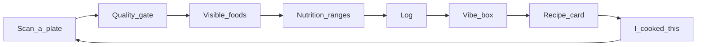

# Platter — MVP Scope

[`Vision.md`](Vision.md) is the aspiration. It is deliberately hopeful, and parts of it assume infrastructure and data density that a pre-launch app does not have. This document is the **buildable subset**: the smallest version of Platter that still sells what the app is for, with every cut justified.

**MVP promise:** *scan a plate, know roughly what's in it and what it costs you nutritionally — then ask for something to eat and get a recipe you can actually cook tonight.*

That is two loops, not eight surfaces.

| Doc | Role |
|-----|------|
| [`Guide.md`](Guide.md) | What works today |
| **This file** | What v1 ships, and what it explicitly does not |
| [`Vision.md`](Vision.md) | Where it goes after v1 |
| [`AnalysisPipeline.md`](AnalysisPipeline.md) | Pipeline design (stages, schemas, fusion) |
| [`PLANS.txt`](../PLANS.txt) | Phased engineering order for the analysis stages |

---

## Table of contents

1. [Where we actually are](#where-we-actually-are)
2. [The two loops](#the-two-loops)
3. [What got cut, and why](#what-got-cut-and-why)
4. [What we accept losing](#what-we-accept-losing)
5. [Scope by surface](#scope-by-surface)
6. [Data model additions](#data-model-additions)
7. [API additions](#api-additions)
8. [Milestones](#milestones)
9. [Honesty rules that survive the cut](#honesty-rules-that-survive-the-cut)
10. [Risks to check before building](#risks-to-check-before-building)
11. [How we know the MVP worked](#how-we-know-the-mvp-worked)

---

## Where we actually are

The quality gate and its persistence/read foundation are done; the visible-food
stage is not:

```
OpenCV technical checks (app/image_quality.py)
  → Claude vision node (app/graph/nodes.py)
  → evaluate_quality() (app/quality_decision.py)
  → persisted as `technical_quality` and `vision_quality` artifacts,
    plus a typed `meal_gate_verdicts` row
```

`evaluate_quality()` already returns three separate verdicts — `accepted` (fails open), `nutrition_ready` (fails closed), `analysis_complete` (informational) — with 35 tests behind it. The graph is still `START → image_quality → END`. The schema already has `analysis_runs`, per-stage `analysis_artifacts`, and the derived `meal_foods` projection; M1 must begin writing `quality_context` and `visible_foods` artifacts and project the latter into `meal_foods`.

So: the hard part of *not embarrassing ourselves on bad photos* is solved, and the part the app is named for is not started. The MVP is mostly about spending that gate on something.

`GET /api/meals/{meal_id}` already returns the gate verdict, `nutrition_ready`, and an empty `foods` list. M1's API work is to populate that existing response after the visible-food stage ships, plus add route and ownership tests.

---

## The two loops



**Loop 1 — Scan → know.** Extends the existing pipeline by two stages: what foods are visible, and roughly what they cost nutritionally, as ranges. This is `PLANS.txt` Phase 1 and Phase 2, unchanged. It is the majority of MVP engineering and it needs no new product domains.

**Loop 2 — Ask → cook.** A text box. The user types a craving or a situation ("haven't eaten all day, something filling", "chips in something sweet"). Backend sends the vibe plus the user's recent food labels and their avoid-list to Claude, gets back one to three recipe cards, each with a one-line why. Open a card, see steps, optionally mark "I cooked this."

Loop 2 has no ranker, no taste-profile tables, no reason-code snapshots, and no restaurants. It is one endpoint and one prompt. It still demonstrates the second of Vision's three selling points, because what sells that pillar is *a fulfillable suggestion with a reason* — not the machinery behind it.

---

## What got cut, and why

Every cut below is either unbuildable at our data density, or buildable later at the same cost.

### Go cards, restaurants, places, UGC catalog

Vision gates all Go recommendations on the likely-to-visit set, and states the cold-start rule itself (`Vision.md:237`): if the set is empty, home is cook-only. **Every user of a brand-new app has an empty set.** Go cards are therefore dead code for the entire MVP population, and the tables that feed them (`places`, `dishes`, `user_places`) would collect data for a ranker that doesn't exist.

v1 is cook-only by design, not by accident. This single cut removes places, dishes, visit counting, open-now filtering, maps deep links, and the crowd catalog.

### GPS → city geocoding

`image_metadata.py:117-128` computes `gps_latitude` / `gps_longitude`; `meals.py:93` drops them; `meal_contexts.city` / `country` are dead columns. The instinct to cut this is right, for a reason stronger than effort:

**the signal is too sparse to build on.** Web uploads are the only source today (`source` is hardcoded `"web_upload"`). Desktop-sourced photos frequently have no GPS at all, iOS strips location on share by default, and screenshots and re-saved images have nothing. A feature keyed on EXIF GPS would fire for a minority of uploads, unpredictably — the worst shape for a recommendation input.

It also drags in a geocoding provider, rate limits, caching, and a location-privacy consent surface. Cut entirely. The columns stay; nothing reads or writes them.

### Segmentation and spatial grounding

Already gated in `PLANS.txt` Phase 3 behind evidence that portion geometry is the accuracy bottleneck. Nothing in the MVP changes that. Portion estimation in v1 is coarse, from the visual stage's own hints, and the uncertainty goes into the range width.

### Taste profile, taste events, recommendation snapshots, reason codes

I previously argued implicit taste signals are unbackfillable and worth capturing immediately. I'd narrow that: **explicit** signals (saves, favorites, cooked) are captured by the tables below, and they are the ones a thin ranker would actually use. A full `taste_events` log plus `recommendations` snapshots is service scaffolding for a ranker the MVP does not have. Defer both.

### Glucose, tiers, households, pantry, shopping lists, sliders-as-a-system, overlays

All backfillable, none load-bearing for either loop. `Vision.md` itself files most of these under "quiet in the UI" or "horizon."

### Trends

`Vision.md:76` calls the existing mock an anti-pattern twice and says replace, don't wire. MVP action is one line: remove the `/trends` NavLink from `App.tsx:35-38`. Leaving it in the nav is how it eventually gets wired by default.

### Async pipeline

`PLANS.txt` already decided sync, with documented switch triggers. Keep sync — prompts for two new stages will be iterated constantly and sync is one debug loop. But see [Risks](#risks-to-check-before-building): one trigger needs checking *before* the second model call ships, not after.

---

## What we accept losing

Stating this plainly so it isn't a surprise later:

- **Implicit interaction telemetry during the MVP window.** Views, skips, and dwell are gone forever for meals logged before a ranker exists. Accepted: no ranker will read them, and the explicit signals are preserved.
- **Location history on MVP-era uploads.** Recoverable if it ever matters — original files sit in R2 with EXIF intact, so a backfill script is possible. This is why GPS is a cheap cut rather than a permanent one.
- **Restaurant meals are second-class.** A user who eats out gets the scan loop (foods, nutrition, log) but never a Go suggestion. Honest framing beats a fake catalog.

One thing we do **not** accept losing: **what people type into the vibe box.** That is the only record of demand, it cannot be reconstructed, and it is the input to deciding what v2 builds. Hence `vibe_queries` below — one table, one insert, kept purely as product research.

---

## Scope by surface

Nav: **Discover · Scan · Log · You**. Four items, replacing Scan/Log/Trends/Profile.

| Surface | MVP scope | Not in MVP |
|---------|-----------|------------|
| **Discover** (home) | Vibe text box → 1–3 recipe cards, each with one why line. Cold start: vibe box + a single "scan your first plate" card. | Ranked card stack, insight lines, taste-based personalization, Go cards, "make this meal work" |
| **Scan** | Existing upload + gate, plus detected foods with per-item confidence, nutrition ranges when `nutrition_ready`, and a save button | Place/dish tagging, portion correction UI, user confirmation prompts on ambiguity |
| **Log** | Existing list, plus food labels on each card, a saved/favorite filter, and neutral empty states | Calendar view, streaks, "your plates this week" |
| **You** | Merge `Profile.tsx` + `EditProfile.tsx`: name, calorie target (exists), one approach template, one taste↔health slider, an avoid list | Slider panel, overlays, tags taxonomy, glucose, tier display, constraint wizard |

Home is Discover, per Vision's locked fork — the cold-start card keeps that cheap rather than requiring a populated ranker.

---

## Data model additions

Four changes. Migrations `0003`–`0005`, forward-only via the existing `app/migrate.py`.

**1. Write analysis artifacts and project foods** (no migration needed for M1). The existing run/stage schema accepts `quality_context` and `visible_foods`; `meal_foods` is the derived projection read by the API. M1 writes `quality_context` and `visible_foods` and projects visible foods into `meal_foods`. M2 adds `nutrition`. `quality_context` is a pure-Python derivation and is worth persisting since it is the first consumer of the `portion_difficulty` / `depth_unclear` / `food_overlap_level` signals that are collected today and read by nobody.

**2. Extend `users`** rather than adding a profile table — it already carries `daily_caloric_target`.

```sql
ALTER TABLE users ADD COLUMN IF NOT EXISTS approach_template TEXT;   -- 'flavor_first' | 'even_plate' | 'nourish_first' | 'tight_budget'
ALTER TABLE users ADD COLUMN IF NOT EXISTS taste_health_bias INTEGER; -- 0 = taste, 100 = health
ALTER TABLE users ADD COLUMN IF NOT EXISTS avoid_foods TEXT[];        -- allergens + dislikes, one list
```

Four templates, not seven. Two of Vision's seven (`By the Numbers`, `In Season`) are protocol-driven and need nutrition accuracy we won't have on day one; `Science Plate` is a tag bundle.

**3. `meal_saves`** — one table, not two. Favorite is a flag on a save, not a separate concept.

```sql
meal_saves (user_id, meal_id, is_favorite BOOLEAN, created_at)  -- PK (user_id, meal_id)
```

**4. `recipes`** and **`vibe_queries`**.

```sql
recipes (recipe_id, user_id, title, ingredients JSONB, steps JSONB,
         time_minutes, servings, source TEXT,  -- 'generated' (only value in MVP)
         cooked_at TIMESTAMPTZ, created_at)

vibe_queries (query_id, user_id, prompt TEXT, created_at)
```

A recipe row is written when the model returns a card, so "I cooked this" has something to point at. `source` exists now to avoid a migration when recipes-from-scans arrive.

---

## API additions

| Endpoint | Purpose |
|----------|---------|
| `GET /api/meals/{meal_id}` | **Exists today.** Single meal with the gate verdict, food projection, and `nutrition_ready`; M1 populates foods and M2 adds nutrition. |
| `PUT` / `DELETE /api/meals/{meal_id}/save` | Save and favorite (body carries `is_favorite`) |
| `POST /api/vibe` | `{prompt}` → 1–3 recipe cards; writes `vibe_queries` and `recipes` |
| `POST /api/recipes/{recipe_id}/cooked` | Closes the loop; sets `cooked_at` |
| `PATCH /api/users/me` | Extend existing route with template, bias, avoid list |

**`nutrition_ready` must reach the client.** `PLANS.txt:162-165` flags this as open: a meal that is `accepted` but not `nutrition_ready` currently returns `status: "completed"` with no signal that analysis didn't run. Add `nutrition_ready` as a response field on `MealPublic` and `MealUploadResponse` rather than a new `status` value — the `meal_uploads.status` CHECK constraint stays untouched, and status keeps meaning "did we store this."

---

## Milestones

Each one is independently shippable. Ordering is forced: Discover is only worth building once the log contains food labels to ground it.

**M1 — Foods visible.** `VISIBLE_FOODS_SCHEMA`, `build_quality_context()` (pure function, unit-tested), `visual_understanding_node`, conditional routing in `builder.py` so rejected photos skip the second model call, persist `quality_context` / `visible_foods` as stage artifacts and project visible foods into `meal_foods`, render labels in Scan and Log. `GET /api/meals/{id}` is already present; add API coverage for its food and ownership behavior.
*Ships:* upload a plate, see "jollof rice, grilled chicken, plantain" with confidence. First time the app does what its tagline says.

**M2 — Nutrition ranges.** USDA FoodData Central client (`USDA_API_KEY` is already in `.env.example:8`, unused), label→food matching with a cache, coarse portion estimation from the visual stage's hints, macro **ranges** widened across unresolved `possible_types`, frontend display gated on `nutrition_ready`.
*Ships:* the thing the app is for.

**M3 — Save and You.** `meal_saves`, the `users` columns, merged You surface, saved filter in Log, Trends removed from nav.
*Ships:* small, and it supplies Loop 2's inputs.

**M4 — Discover.** Vibe box, `POST /api/vibe`, recipe card with steps and a why line, "I cooked this," cold-start card.
*Ships:* the second selling point.

M1 and M2 are the bulk of the work. M3 is a day or two. M4 is one endpoint, one prompt, one page.

---

## Honesty rules that survive the cut

Non-negotiable, because they're what makes the gate worth having:

- **Anything emitting a calorie or macro number branches on `nutrition_ready`, never on `accepted`.** This is the Phase 2 contract in `PLANS.txt:159-160` and the reason the two gates have opposite failure preferences.
- **Ranges and confidence, never point estimates.** Multiple plausible `possible_types` widen the range rather than collapsing to a guess.
- **A degraded stage never aborts the upload transaction.** Every new VLM node follows `image_quality_node`'s contract: catch everything, return `{"analysis_error": ...}`, never raise.
- **No judgment in copy.** Missed days are empty, not red. No nagging about uploads.
- **No medical claims.** Recipes respect the avoid list; they are not allergen-safety guarantees, and nothing tells a user they shouldn't eat something.

---

## Risks to check before building

These are gates, not a backlog. Resolve the M1 gates before adding the second
vision call; resolve the M2 gates before emitting a nutrient number; resolve
the M4 gates before accepting real vibe traffic.

**1. Production path and timeout — M1 gate.** The deployment manifests use an
AWS Application Load Balancer (`k8s/ingress.yml`), not a Cloudflare proxy;
Cloudflare R2 is object storage only. The manifest does not set an ALB idle
timeout, whose AWS default is 60 seconds. Verify that the DNS records,
certificate, ALB listener, and `api.useplatter.ca` health endpoint are live,
then measure p50/p95 and timeout/error rate for authenticated uploads through
that real path. Test one, two, and five concurrent uploads, not only one
happy-path photo. M1 adds another model call to a request that already does
R2 writes and one vision call. A p95 near the configured deadline, a timeout,
or unacceptable concurrent-request behaviour overrides the sync decision.

**2. One-pod synchronous capacity — M1 gate.** The production backend has one
replica, the default single Uvicorn worker, and a 400m CPU limit
(`k8s/backend-deployment.yml`; `app/Dockerfile`). The async FastAPI upload
handler currently calls synchronous OpenCV, R2, and Anthropic code directly.
Consequently a slow upload can delay unrelated requests. Benchmark the real
pod under the concurrency test above and decide explicitly whether to add
workers/replicas, move blocking work off the event loop, or make analysis
durable and async. `BackgroundTasks` can shorten the client wait, but is not
a durable queue and does not add capacity or survive a pod restart.

**3. USDA coverage, limits, and failure mode — M2 gate.** FoodData Central is
thin on jollof rice, egusi, and plantain preparations — the dishes in our own
examples. Build and hand-review a representative match set before M2; define
what counts as an acceptable match and a maximum useful range width. The
client needs a persistent positive and negative cache, request timeout, 429
handling, and a measurable source in the nutrition payload (`usda_match` vs
`model_estimate`). FoodData Central's default limit is 1,000 requests per hour
per IP, so per-food live lookups are not a viable steady state. A VLM fallback
must be deliberately wider and visibly marked as an estimate, never presented
as an equivalent USDA result.

**4. Model cost and abuse controls — M1/M4 gate.** Two Opus calls per accepted
meal, plus generated recipes, create a paid endpoint that a newly created
account can repeatedly exercise. Before exposing M1, measure input and output
tokens, latency, and cost for representative photos; set a per-user/IP upload
limit, a cost alert/cap, and an operational error budget. Before M4, also limit
vibe prompt length and request rate, validate the structured recipe response,
and constrain the prompt so user text cannot override avoid-list or safety
instructions. Only consider a cheaper quality model after the existing gate
regression suite passes against it.

**5. Avoid list is not allergen safety — M4 gate.** Free-text avoids must be
normalized and checked against ingredients, substitutions, and uncertainty; a
prompt-only instruction is not enough. Recipe UI and API copy must say that the
result is not allergen-safe or medical advice, avoid affirmative medical
claims, and make uncertain ingredients visible. Decide what happens when the
model cannot confidently meet an avoid list: return no card or request a
different prompt, rather than quietly suggesting a risky substitute.

**6. Vibe-query privacy and retention — M4 gate.** `vibe_queries.prompt` is an
intentionally permanent product-research record, but it can contain health,
religion, pregnancy, eating-disorder, or household information. Choose a
retention period, deletion/export behaviour, and who can access raw prompts
before writing the table. Store the minimum data needed to learn from queries;
do not let an analytics need silently become indefinite retention of sensitive
text.

**7. Schema baseline status — planning correction.** The old baseline-drift
risk is resolved for the documented disposable development database:
`0001_baseline.sql` is an intentional from-scratch baseline, not an
`IF NOT EXISTS` reconstruction, and `PLANS.txt` records the re-baseline.
`nutrition_ready` is already exposed by the meal read models. Do not create
work to fix either premise. If a separate persistent production database
exists, inventory it and run a schema-only diff before migrations `0003`+
are applied; otherwise, treat new migrations as normal forward-only changes.

---

## How we know the MVP worked

Measurement, not vibes — and the first two must gate their own milestones.

| Question | Measure |
|----------|---------|
| Does food ID actually work? | Freeze a hand-labeled evaluation set of ~50 real meal photos before prompt tuning (include non-Western dishes and non-food negatives). Report per-item precision, recall, and false positives by cuisine before M2 starts. Define the go/no-go threshold in advance. |
| Are the ranges honest? | Range coverage: how often does a known true value fall inside the stated range? A range that's always right and always 400–1200 kcal is useless — track median/percentile width alongside coverage, split by USDA match and model fallback. |
| Does anyone want the vibe box? | Vibes per active user per week; share of vibes where a card is opened. |
| Does the loop close? | Share of opened recipes marked cooked. This is the single number that says the product works. |
| Is the gate still good? | Keep the existing suite green; watch false rejections on real uploads. |

If food ID precision is poor, M2 is not worth building yet — the fix is the visual prompt, not the nutrition layer. Nutrition built on bad labels is confidently wrong, which is worse than the current honest silence.

---

## Explicitly not in v1

Restaurant/Go cards · places and dishes · GPS and geocoding · segmentation and masks · async queue and workers · taste profile and event log · recommendation snapshots and reason codes · glucose · tiers and entitlements · pantry · shopping lists · households · open-now · voice vibe · tracker import · widgets · sharing · offline scan · Trends dashboard · recipe library · human-in-the-loop confirmation prompts

Each is a later addition at the same cost, or waits on data v1 produces.
