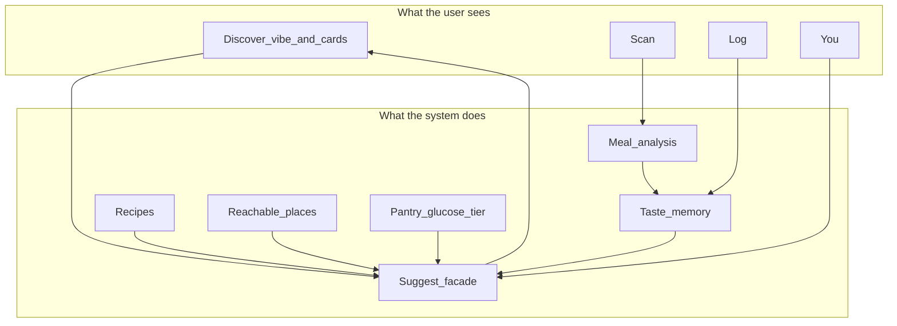
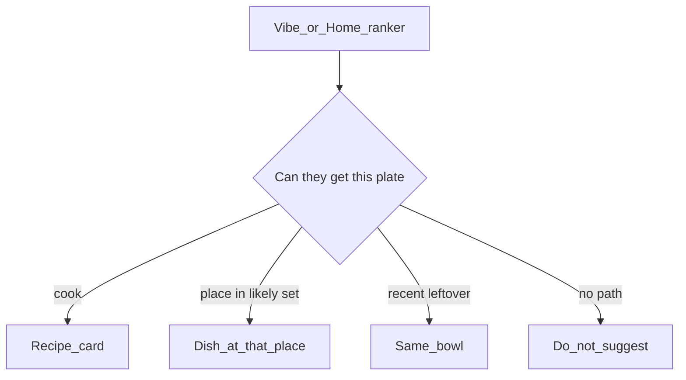
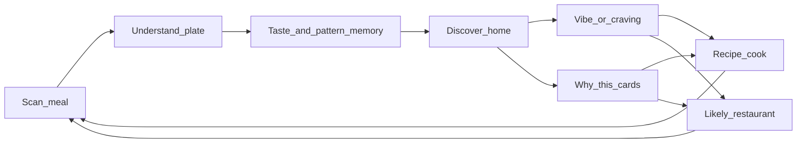
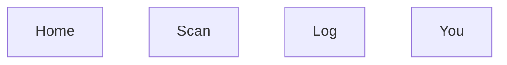
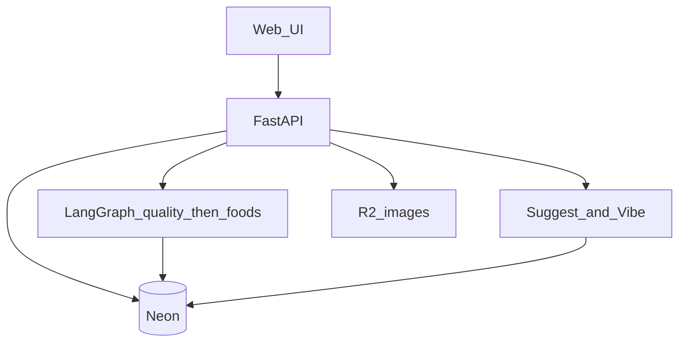

# Platter — Product Vision

Platter’s job is not “make people eat healthier.” It is to find, per person, a **satisfying plate they can live with** — taste, context, money, health, and constraints — without shame.

**Eat what you want. Know enough to not worry.**

This file is the **product** source of truth: mission, tone, what the app looks like, and the domain we are building toward. It is aspirational on purpose.


| Doc                                          | Role                                                                             |
| -------------------------------------------- | -------------------------------------------------------------------------------- |
| **This file**                                | What Platter should become and how it should feel                                |
| `[MVP.md](MVP.md)`                           | The buildable subset of this doc for v1, and what it cuts                        |
| `[Guide.md](Guide.md)`                       | How upload and analysis work **today**                                           |
| `[AnalysisPipeline.md](AnalysisPipeline.md)` | Quality → foods → nutrition pipeline design                                      |
| `[PLANS.txt](../PLANS.txt)`                  | Phased engineering build (visual understanding, nutrition ranges, later spatial) |


---


## Table of contents

1. [How docs relate](#how-docs-relate)
2. [Locked product forks](#locked-product-forks)
3. [Principles](#principles)
4. [Simple surface, deep model](#simple-surface-deep-model)
5. [Approaches](#approaches)
6. [Fulfillment](#fulfillment)
7. [Core loop](#core-loop)
8. [App surfaces](#app-surfaces)
9. [Suggestions facade](#suggestions-facade)
10. [Feature inventory](#feature-inventory)
11. [Starting architecture](#starting-architecture)
12. [Tone and gamification](#tone-and-gamification)
13. [Mapping to today’s repo](#mapping-to-todays-repo)
14. [Will not build yet](#will-not-build-yet)

---


## How docs relate

Engineering can ship Phase 1–2 of `PLANS.txt` (visible foods, then calorie/macro **ranges**) without waiting for every product domain below. Discover can still run on vibe text + saves before nutrition exists.

Do not treat this document as a tab list. The large model is **backend**. The UI stays thin.

---


## Locked product forks

- **Home is Discover**, not Scan. Scan stays a primary action.
- **Restaurants are UGC-first.** Photos and user-named places become a personal catalog (and later a crowd catalog). Official partner menus come later.
- **Every suggestion is fulfillable.** Cook cards include a recipe. Go cards only appear if the user is likely to visit that place.
- **Simple product, deep machinery.** Most capabilities hide behind Discover, Scan, and a few settings. They are not extra tabs or equal selling points.

---


## Principles

These are hard rules. They change copy, streaks, recs, and what we refuse to ship.

- **No judgment.** Missed days are neutral (white / empty), never red. Do not nag about missed uploads, broken streaks, or “you fell off.”
- **Explain, don’t scold.** Every recommendation has a short **why this for you**.
- **Goals are opt-in intensity.** Health is available, never assumed. Flavor-first users are first-class, not a guilty mode.
- **Uncertainty is honest.** Nutrition stays ranges and confidence, as in `[AnalysisPipeline.md](AnalysisPipeline.md)` Phase 2 — not fake precision.
- **Earn features, don’t punish.** Tiers unlock capability (more vibes, deeper restaurant memory, glucose insights). They do not shame inactivity.
- **Context over calories.** Time of day, hunger, money, “I haven’t eaten,” cook vs go matter as much as macros.
- **Simple on purpose.** The user opened a meal app, not a dashboard of systems. Depth lives in ranking, memory, and recipes — not in navigation or jargon.

The current Trends mock in `frontend/src/pages/Trends.tsx` is an anti-pattern twice: judgmental language (“perfect streak,” “health score A-,” “top 10%”) **and** too many competing metrics on first paint. When that screen becomes real, replace it — do not wire it to live data as-is.

---


## Simple surface, deep model

The feature list is a **backend map**, not a marketing site and not a tab bar. If everything is equally visible, the app is complicated.

1. **What we sell** — few, obvious, daily
2. **What the system does** — many, quiet, compounding
3. **What stays in You / on a card** — power, not homepage


### What we sell

To a new user, Platter is three things:

- **Scan a plate** — understand it without a lecture
- **Ask for a vibe** — get something you can actually eat tonight (cook or go)
- **A home that already knows you** — a few cards with a short why, not a feed of modules

Favorites, glucose, tiers, pantry, shopping lists, households, open-now, leaderboards, and “make this meal work” are **not** co-equal selling points.

### What stays abstracted

These exist so suggestions get better. They should rarely be destinations.


| Capability                                           | How the user meets it                                               |
| ---------------------------------------------------- | ------------------------------------------------------------------- |
| Taste profile, taste events, repeat clustering       | Invisible. Better cards and a one-line why.                         |
| Approach templates + sliders                         | One choice at signup; sliders under You. Recs just feel right.      |
| Reachable restaurants                                | Favorite a place or scan there. Never “manage your venue graph.”    |
| Recipes as objects                                   | Open a cook card → steps. No recipe-library tab until they ask.     |
| Auto-save / favorites                                | Heart or save on a meal. Frequency-save happens quietly.            |
| Make this meal work                                  | Below the fold on a card, one control, not a workshop.              |
| Constraints, pantry, budget                          | Optional chips in You or on a vibe; default to silence.             |
| Glucose                                              | Opt-in overlay. Improves recs; not a clinic UI.                     |
| Tiers                                                | Unlock quietly (“you can run more vibes”). No XP treadmill on Home. |
| Gamification                                         | Private “your plates this week” at most. Not a fourth pillar.       |
| Horizon extras (lists, household, open-now, widgets) | In context when relevant, never as empty nav.                       |


**Three daily verbs:** Scan · Discover (vibe + cards) · look back (Log). Everything else hangs off a card or You.

Do not add a tab per domain object. `recipes`, `user_places`, `taste_events`, `glucose_readings` are tables and services, not screens.

**Copy rule:** never expose system nouns (“reachable set,” “fulfillment kind,” “reason codes”). Say “because you’ve been here” / “you can cook this in 20 minutes.”




---


## Approaches

Drop **Pure enjoyer** as a first-class mode. Everyone is:

1. A **starting template** (sets defaults)
2. A small set of **sliders / tags** they can move anytime
3. **Overlays** that stack (diabetic, athlete, budget, allergen, diet, religion, kitchen access)

Templates are onboarding, not cages.


| Template       | Intent                                                    |
| -------------- | --------------------------------------------------------- |
| Flavor First   | Taste over optimization; still wants something good       |
| Even Plate     | Balance of satisfaction and health                        |
| Nourish First  | Health is the priority; it still has to taste like a meal |
| By the Numbers | Strict protocol / eat as needed                           |
| In Season      | Training: athlete / bulk / cut as a sub-choice            |
| Science Plate  | Gut, vegan, evidence-based constraints as tags            |
| Tight Budget   | Money as a first-class constraint, not a personality      |


**Diabetic** is an overlay (glucose ingest + safer recs), not a competing lifestyle.

**Sliders the profile stores:** taste ↔ health, strictness, budget, time-to-cook, restaurant vs home bias.

**Tags:** vegan, gut, bulk, cut, allergens, and similar — constraints as data, not moral categories.

**Onboarding:** pick a template → optional calorie target (already on `users`) → optional constraints. Discover can work with almost nothing. Scan improves the model.

---


## Fulfillment

A suggestion without a path to the plate is just a mood. Discover cards are always one of:


| Kind              | How they get the meal                            | When it can appear                                 |
| ----------------- | ------------------------------------------------ | -------------------------------------------------- |
| **Cook**          | Recipe (ingredients, steps, time, leftover note) | Default for home / vibe / “make this meal work”    |
| **Go**            | Named dish at a place they actually use          | Only if that place is in their likely-to-visit set |
| **Again** (later) | Leftovers / same bowl they already logged        | If a recent home meal is still plausible           |


Do **not** recommend an abstract dish (“grilled salmon”) with neither a recipe nor a reachable restaurant.

### Recipes

Recipes are how non-restaurant suggestions become real — first-class objects, not an add-on.

- A vibe like “chips in something sweet” or “haven’t eaten, something filling” resolves to a **recipe card**, tuned to template/sliders when those exist.
- A scanned **home** meal can be promoted into a reusable recipe (their food, their method). That is the best personalization source before any licensed corpus.
- Start with **generated recipes + recipes derived from the user’s own logged meals**. A curated library can come later; Discover does not need it to work.
- Recipe fields: title, ingredients, steps, time, servings, optional cost band, allergen flags, link back to source meals if derived from a scan.
- “Make this meal work” is a **recipe delta** (swap, add, skip) on that same card — not a second product.


### Restaurants: likely to visit, not somewhere on earth

Crowd UGC is **storage**, not the recommendation pool.

A place enters the user’s likely-to-visit set from signals such as:

- Favorited restaurant (explicit)
- Saved or favorited dishes from that place
- Repeat scans tagged to that place (auto, after N times)
- Recent visit (for example last 14–30 days)
- Usual geography once EXIF GPS → city is wired
- Optional “I go here” list under You

Suggest a restaurant meal only if the place is in that set **and** the dish fits the vibe/goal. Why-this copy should say which signal fired (“you’ve been here three times,” “you saved this place,” “near your usual lunch area”).

**Cold start:** if the set is empty, Home is cook-only until they favorite a place or scan a restaurant meal.

Official menus and partnerships stay later. UGC still needs a **place name + dish name** on scan so the set can form.




---


## Core loop




1. User scans (or later tags a named restaurant dish).
2. Pipeline writes a meal. Today that is the quality gate. Later: visible foods, then macro ranges (`nutrition_ready`, not merely `accepted` — see `Guide.md`).
3. Saves, repeats, and favorites feed taste memory. Most of this is invisible.
4. Home shows a vibe field and a short stack of fulfillable cards, each with a why.
5. Acting on a rec produces another meal. Cook uses a recipe. Go only uses likely places.

---


## App surfaces

Nav stays small. Evolve `frontend/src/App.tsx`; do not grow it with every domain.


| Surface             | Job                                                                                                                                                                                              |
| ------------------- | ------------------------------------------------------------------------------------------------------------------------------------------------------------------------------------------------ |
| **Home (Discover)** | Default landing. Vibe field + a short stack of cook/go cards + why. One insight line if useful (“you reach for X when evenings run long”). “Make this meal work” only after scroll, one control. |
| **Scan**            | One job: capture a meal. Keep quality-gate honesty. Later: foods, ranges, save/favorite, optional restaurant tag.                                                                                |
| **Log**             | Look back. Neutral calendar. Saves and favorites are filters or actions here, not a fifth tab unless a library is clearly needed.                                                                |
| **You**             | Template, quiet sliders, constraints, optional glucose. Power users go here. Nobody is onboarded through a settings maze.                                                                        |


Trends is **not** a selling surface. Fold patterns into Home (one line) or You. Do not ship the four-metric dashboard.




---


## Suggestions facade

Recommend / Vibe is the **product facade**. Profile, likely places, recipes, pantry, glucose, and analysis all feed it. The client mostly sees:

```text
Suggestion {
  title
  kind: cook | go | again
  why[]          // short human lines, not internal codes
  action         // open recipe, pin place, cook tonight, ...
}
```

New capabilities plug into this facade **before** they earn a UI.

Internally, rankers may use reason codes (`favorite_place`, `been_here_recently`, `filling_vibe`, `budget`, `matches_evening_pattern`). Persist those on recommendation snapshots so “why this” is reproducible. The UI never shows the code names.

**Save policy:** log everything that passes the food gate. **Favorite** is explicit. **Saved** can be explicit or automatic when a near-duplicate is eaten N times (including restaurant dishes). Duplicates key off fused food labels + place, not pixels.

---


## Feature inventory


### Sell (daily product)

- Scan a meal photo
- Discover: vibe in, fulfillable cards out
- Short why on every card
- Log to look back without shame


### First-class in the model, quiet in the UI

- Saved vs favorite (favorite = more actions: remix, pin a place, make this work)
- Auto-save of frequent meals and variations
- Recipes (generated and/or from home scans)
- Likely-to-visit places gating all Go recs
- UGC place + dish on scan (name, photo; city when geocoding exists)
- Approach templates, sliders, overlays
- Taste profile from saves, repeats, vibe history, skips
- Constraints as data (allergens, dislikes, kitchen, budget, time)
- Make this meal work as a below-fold recipe delta
- Honest uncertainty on identified foods and nutrition ranges
- Non-judgmental calendar; private “your plates this week”
- Tiers as quiet capability unlocks
- Glucose as optional overlay (manual first, CGM later) — personalization, **not** a medical-device claim


### Horizon (later / optional, not v1)

- Shopping list from an accepted cook card
- Pantry / fridge context (typed list first; photo-of-fridge later)
- Open now / hours as a filter on Go cards (does not expand the catalog)
- Household sharing: shared places, grocery list, “what’s for dinner” — **without** merging health scores
- Ingredient swaps for Tight Budget / allergens (extends make-this-work)
- Voice or one-line vibe, same backend as typed vibe
- Import from other trackers so taste memory is not empty on day one
- Maps or delivery deep link on a Go card — still only likely places
- Lock-screen / widget when mobile exists: today’s cook-or-go, not a shame meter
- Share a plate as a meal card, not a calorie report
- Offline-ish scan when mobile exists (`PLANS.txt` already flags dropped connections)

---


## Starting architecture

Stay on the current stack: React + Vite, FastAPI, Neon, R2, LangGraph / Claude. Add **product domains beside** the analysis pipeline. Do not stuff recipes, places, and vibes into `meal_uploads`.




### Target domain (tables come later)

- `users` + **profile**: template, sliders, tags, `daily_caloric_target` (already exists)
- `meal_uploads` + analysis artifacts (quality today; `meal_food_analysis` for later stages)
- `meal_saves` / `meal_favorites`
- `places` + `dishes` (UGC: name, optional geo, created_by, photo meals)
- `user_places` (favorite, visit counts, last_visited_at, optional “I go here”) — this **is** the likely-to-visit set
- `recipes` (title, ingredients, steps, time, source: `generated` | `from_meal` | later corpus)
- `taste_events` (view, save, repeat, skip, vibe accept)
- `recommendations` (snapshot, internal reason codes, `fulfillment`: cook | go | again)
- `vibe_queries` (prompt, situation tags, outputs)
- `glucose_readings` (user, timestamp, value, source) — schema early, product late
- `entitlements` / tier — simple; not a points economy on day one
- Later, named but not built first: `pantry_items`, `shopping_list_items`, `households`

Vision assumes Phase 1–2 of `PLANS.txt` before recs get *nutritionally* good. Discover does not have to wait on Phase 3 (segmentation) or Phase 4 (async, geocoding, k8s removal).

---


## Tone and gamification

The goal of the app is that the user **feels good about eating**, including messy days, cravings, and restaurant food.

- Streaks, if they exist, miss as empty — not red, not “you broke it.”
- Do not talk about missed uploads.
- Rewards are for things they did (a plate they loved, a vibe they cooked, a place they pinned) — not for compliance theater.
- Public leaderboards, if ever, are **opt-in** and never health-shame rankings (“top 10% health score”).
- Private weekly “your plates” can use the user’s own meaning: most satisfying, most on-goal, most creative.

---


## Mapping to today’s repo


| Today                               | Vision                                                              |
| ----------------------------------- | ------------------------------------------------------------------- |
| Nav: Scan, Log, Trends, Profile     | Home (Discover), Scan, Log, You. Trends is not a destination.       |
| `Scan.tsx` upload + quality gate    | Same verb; later foods, ranges, place/dish tag, save/favorite       |
| `Log.tsx` meal list                 | Look back; filters for saved/favorite; no shame copy                |
| `Trends.tsx` fake metrics           | Do not productize. One insight line on Home or You.                 |
| `Profile.tsx` name + calorie target | You: template, sliders, constraints, optional glucose               |
| `POST /api/upload` sync pipeline    | Keep while iterating analysis; async when `PLANS.txt` triggers fire |
| `nutrition_ready` vs `accepted`     | Any calorie/macro UI branches on `nutrition_ready`                  |
| `meal_food_analysis` empty          | Landing zone for visible foods → fusion → nutrition                 |
| GPS extracted, city unused          | Later: usual geography for likely places — still not a map product  |


---


## Will not build yet

- Official restaurant partnerships and live menus
- Suggesting restaurants the user has never shown they visit
- Segmentation-tight portions until Phase 2 data shows geometry is the bottleneck (`PLANS.txt` Phase 3)
- Medical advice, dosing, or “you should not eat this”
- Public health leaderboards
- A tab per domain object
- Wiring the current Trends dashboard to live data as-is

